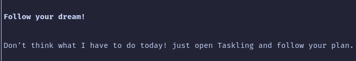

# Tasklings



## Why Tasklings?

Tasklings was built for tracking long-term goals.  
I had a plan with 150 small actionable steps. I needed a way to tackle one task at a time, track progress and stay motivated.  

Tasklings helps break a big dream into steps, keep them in a clean and minimal interface, and move forward with focus.

It is built to answer a simple daily question:  
> "What should I do today to make 1% progress?"  


With Tasklings, your day to day task is simple: follow and execute.


## Features
- Add, mark done/undone, and navigate tasks
- Saves tasks in `~/.tasks` (TOML format)  
- Minimal terminal user interface  

## Contribution
Requires Rust and Cargo.

```bash
git clone https://github.com/charly/tasklings.git
cd tasklings
cargo install --locked --path .

